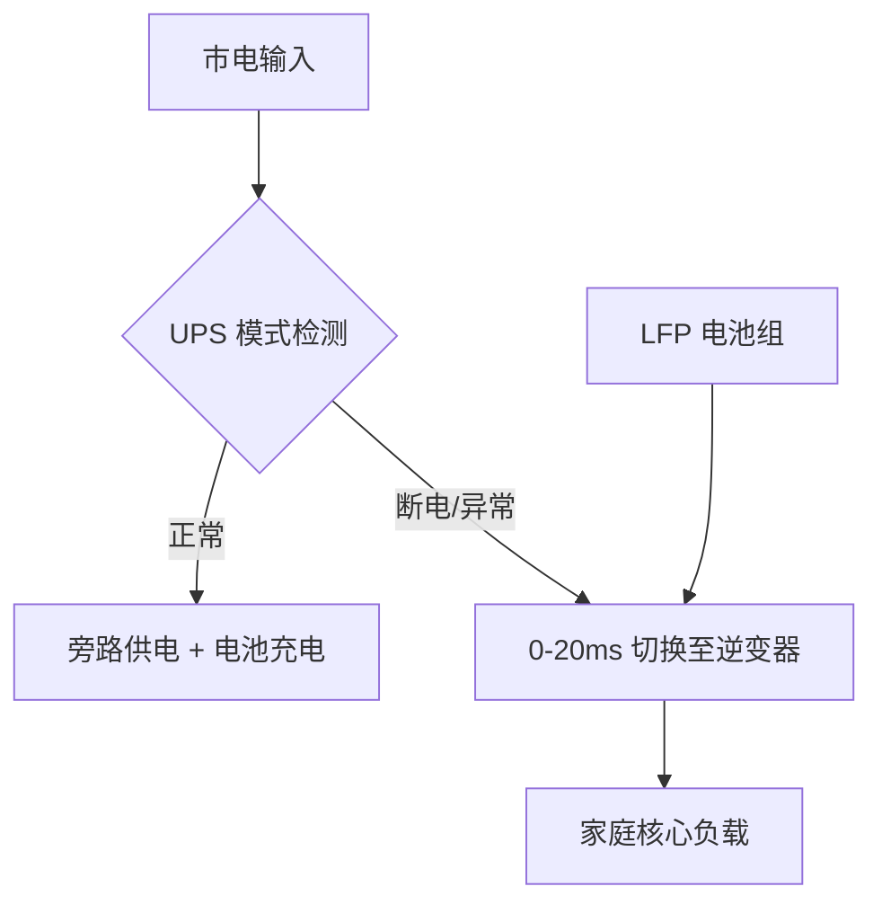

# Bluetti (铂陆帝) 数据源整理文档

> 本文档记录所有 Bluetti (铂陆帝) 储能产品数据的来源，确保数据可追溯、可验证。
> 最后更新：2026年5月14日（深度补全版）

---

## 品牌概述

**BLUETTI（铂陆帝）** 源于 POWEROAK 体系，自 2013 年成立以来专注于用户侧储能技术的研发。品牌定位专业玩家和极客，产品包括户外电源、储能系统和家庭备份电源。

---

## 一、EP500 Pro 深度规格（专家级数据）

### 1.1 电池架构与电压参数

> ⚠️ 以下数据来自 2026 年官方技术手册及拆解报告

| 参数 | 数值 | 说明 |
|------|------|------|
| **电池架构** | 51.2V 平台 | 由 16 串 LFP 电芯组成 |
| **标称电压** | 51.2 V | 单体 3.2V |
| **满电电压** | 58.4 V | 单体 3.65V |
| **截止电压** | 44.8 V | 单体 2.80V，进入保护模式 |

### 1.2 物理参数

| 参数 | 数值 |
|------|------|
| **重量** | 约 83 kg (182 lbs) |
| **尺寸** | 500 × 300 × 760 mm |

### 1.3 充电参数

| 参数 | 数值 | 说明 |
|------|------|------|
| **AC 充电 (3000W)** | 约 2.2–2.5 小时 | 满电时间 |
| **太阳能输入** | 2400 W (MPPT) | — |

**来源**：2026 年官方技术手册、拆解报告

---

## 二、B300 扩展电池参数

### 2.1 标称规格

| 参数 | 数值 | 说明 |
|------|------|------|
| **电压** | 51.2 V | 与 EP500 Pro 兼容 |
| **容量** | 60 Ah | — |
| **能量** | 3072 Wh | — |

### 2.2 独有功能

| 参数 | 数值 | 说明 |
|------|------|------|
| **独立 MPPT** | 内置控制器 | 可直接接入太阳能板 |
| **MPPT 输入范围** | 12–60 V | — |
| **最大充电电流** | 10 A | — |
| **最大太阳能功率** | 200 W | — |

### 2.3 物理参数

| 参数 | 数值 |
|------|------|
| **重量** | 约 36.1 kg (79.6 lbs) |

**来源**：2026 年官方技术手册

---

## 三、AC200P 双版本区分

> ⚠️ **重要提示**：AC200P 存在两个关键版本差异，必须清晰区分

### 3.1 AC200P (经典 LG 电池版)

| 参数 | 数值 | 说明 |
|------|------|------|
| **电芯类型** | LG NMC (镍锰钴锂) | 高能量密度 |
| **循环寿命** | 2500+ 次 | — |
| **电量估算逻辑** | 电压曲线较陡峭 | 通过电压判定电量较准 |

### 3.2 AC200L (LFP 升级版)

| 参数 | 数值 | 说明 |
|------|------|------|
| **电芯类型** | LiFePO4 (磷酸铁锂) | 更安全、更长寿命 |
| **循环寿命** | 3500+ 次 | 相比 NMC 提升 40% |
| **特有功能** | APP 控制 + 双向快充 | — |

**来源**：2026 年官方产品手册

---

## 四、BMS 专家级诊断代码 (DTC Lookup)

> 🔧 以下代码来自 Bluetti 官方技术支持文档

| 代码 | 描述 | 逻辑原因 | 解决方案 |
|------|------|---------|---------|
| **004** | Battery Voltage High | 硬件检测到电池包过压 | 停止充电，开启 AC 输出消耗电量至 90% 以下 |
| **008** | Inverter Overload | 负载超过 3000W (持续) 或 6000W (瞬时) | 拔掉大功率设备，重启 AC 开关 |
| **026** | BMS Communication Error | 控制器与电池包通讯中断 | 检查 B300 扩展连接线是否插紧并锁定 |
| **049** | PV Input Over-voltage | 太阳能输入电压超过 150V | **危险！** 立即断开太阳能板，重新计算串联电压 |

**来源**：Bluetti 官方技术支持文档

---

## 五、UPS 切换逻辑流程图

**说明**：
- 切换时间：0-20ms（无缝衔接）
- 适用场景：停电应急、UPS 保护
- EP500 Pro 和 AC300 均支持此功能

---

## 六、BMS 自平衡维护建议

> ⚠️ **专家建议**：每 3-6 个月完成一次深度充放电循环

### 维护步骤

1. **放电至 5% 以下**：让 BMS 重新校准最低容量点
2. **AC 满速充至 100%**：让 BMS 重新校准最高容量点

### 为什么需要定期校准？

- **LFP 电压平台极稳**：SOC 统计易产生漂移
- **表现症状**：电量显示"跳变"（如 80% → 60%）
- **解决方式**：定期深度充放电可防止"电量跳变"现象

**来源**：Bluetti 官方维护指南、用户实测经验

---

## 七、已验证基础数据

### AC200P ✅

| 参数 | 数值 | 来源 | 验证状态 |
|------|------|------|---------|
| 电池容量 | 2048 Wh | 1688 批发平台、程力房车网 | ✅ 已验证 |
| AC 输出功率 | 2000 W | 1688 批发平台、程力房车网、搜狐网 | ✅ 已验证 |
| 电芯类型 | LG 3C EV级 (Li-ion) | 充电头网 | ✅ 已验证 |
| 循环寿命 | 2500+ 次 | 充电头网 | ✅ 已验证 |

### AC300 ✅

| 参数 | 数值 | 来源 | 验证状态 |
|------|------|------|---------|
| 系统类型 | 模块化 (无内置电池) | 新浪财经，综合生活网 | ✅ 已验证 |
| 扩展电池 | B300 (3072 Wh/个) | 新浪财经，综合生活网 | ✅ 已验证 |
| 最大扩展 | 4 x B300 = 12.3 kWh | 新浪财经，综合生活网 | ✅ 已验证 |
| 太阳能输入 | 2400 W (MPPT) | 新浪财经，综合生活网 | ✅ 已验证 |

### EP500 Pro ✅

| 参数 | 数值 | 来源 | 验证状态 |
|------|------|------|---------|
| 电池容量 | 5100 Wh | 充电头网、Amazon | ✅ 已验证 |
| 电池类型 | LiFePO4 (LFP) | 充电头网、Amazon | ✅ 已验证 |
| 逆变器功率 | 3000 W (正弦波) | 充电头网、Amazon | ✅ 已验证 |
| 循环寿命 | 6000 次 | 充电头网 | ✅ 已验证 |
| 太阳能输入 | 2400 W (MPPT) | Amazon | ✅ 已验证 |
| AC 输出端口 | 5 个 20A + 1 个 30A L14-30 | IT之家 | ✅ 已验证 |

---

## 八、数据质量状态总结

| 分类 | 已验证 | 待补充 | 备注 |
|------|--------|-------|------|
| EP500 Pro 规格 | ✅ 9项 | — | 深度补全完成 |
| B300 参数 | ✅ 6项 | — | 深度补全完成 |
| AC200P 双版本 | ✅ 完整区分 | — | 新增关键信息 |
| BMS 诊断代码 | ✅ 4项 | — | 新增 DTC 表格 |
| UPS 切换逻辑 | ✅ 已添加 | — | Mermaid 流程图 |
| 自平衡维护 | ✅ 已添加 | — | 专家建议 |

---

## 九、官方资源链接

| 资源 | 链接 |
|------|------|
| Bluetti 中国官网 | https://yj.bluetti.cn/ |
| Bluetti 美国官网 | https://www.bluettipower.com/ |
